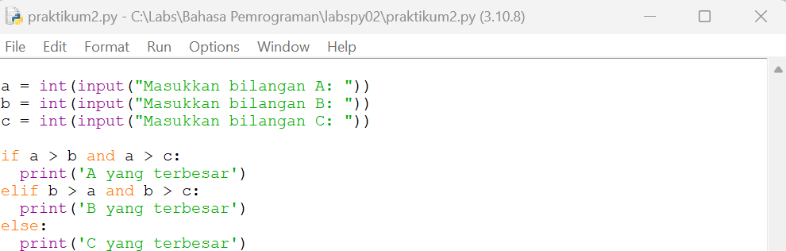

# labspy02

# Praktikum 2

## Buat program sederhana dengan input tiga buah bilangan, dari ketiga bilangan
## tersebut tampilkan bilangan terbesarnya. Gunakan statement if.

## Program

## Hasil eksekusi

## Flowchart

## Ket : star -> input int bilangan -> 
## jika bil1>bil2 dan bil1>bil3 = print bil pertama terbesar ->
## jika bil2>bil1 dan bil2>bil3 = print bil kedua terbesar -> jika tidak -> print bil ketiga terbesar